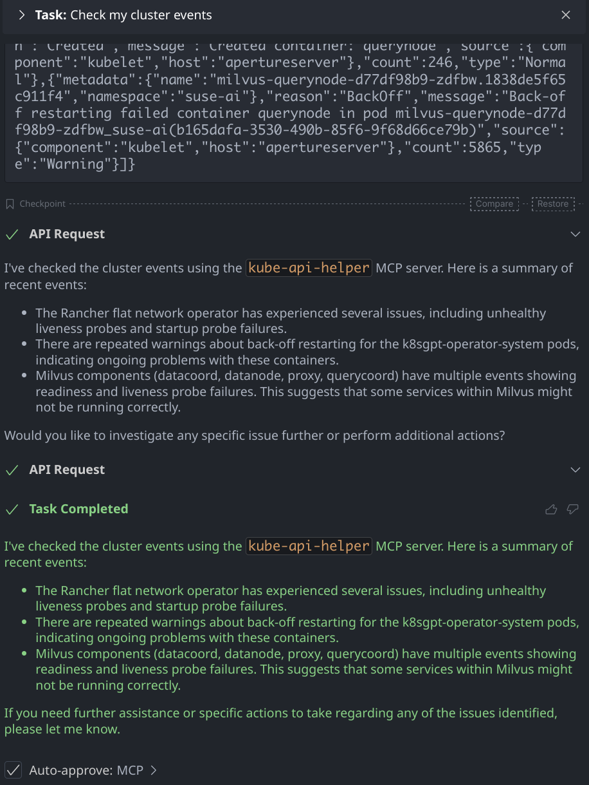
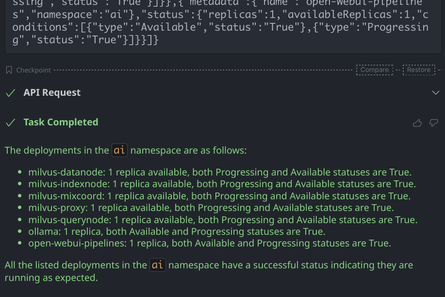
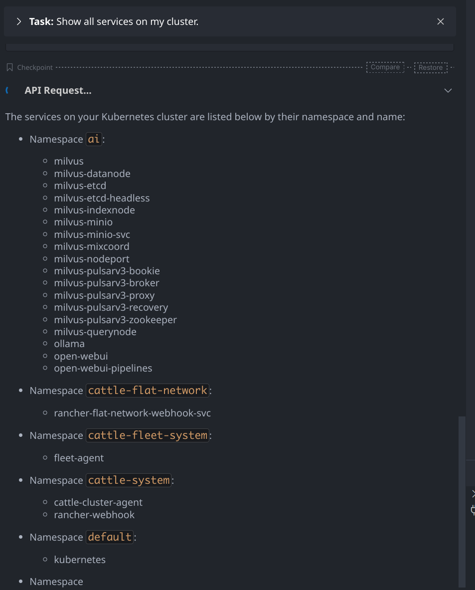
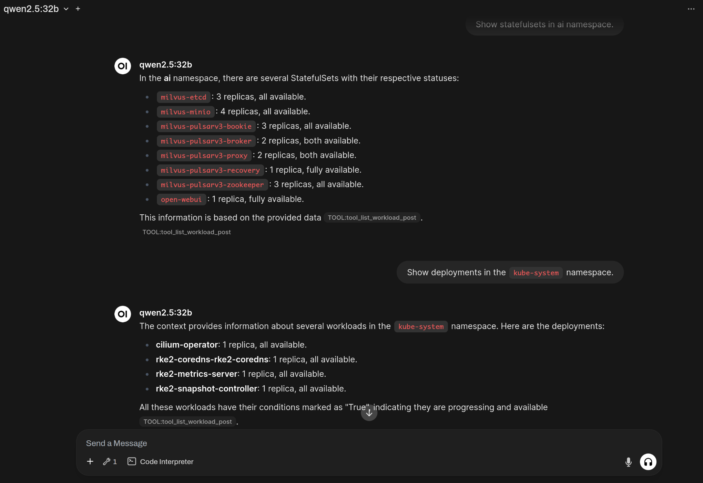
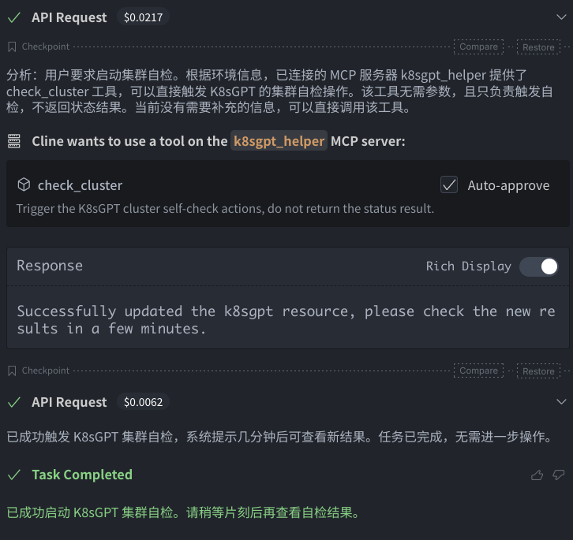
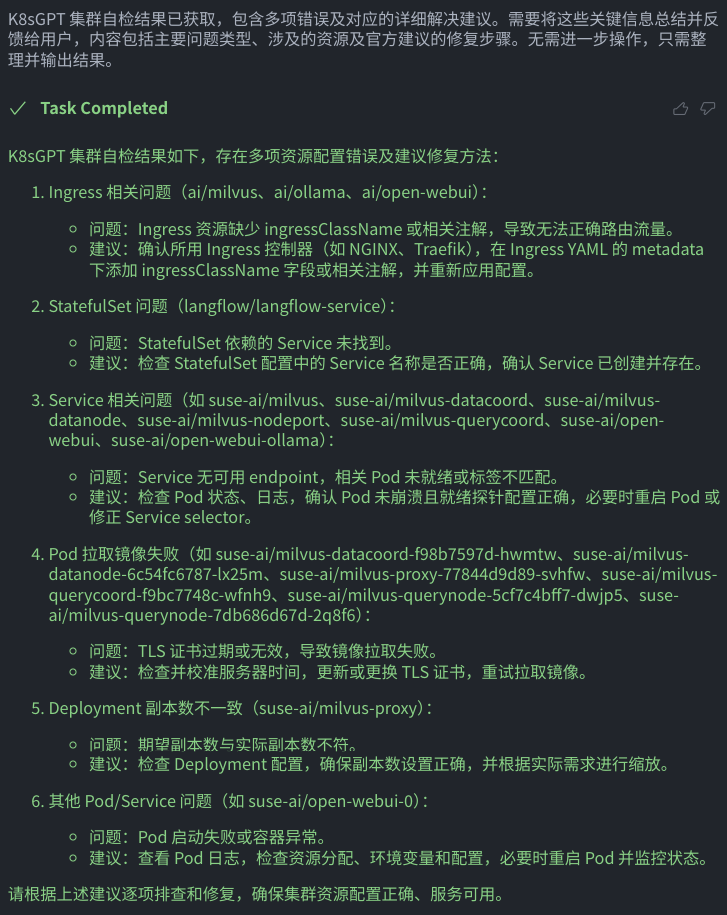
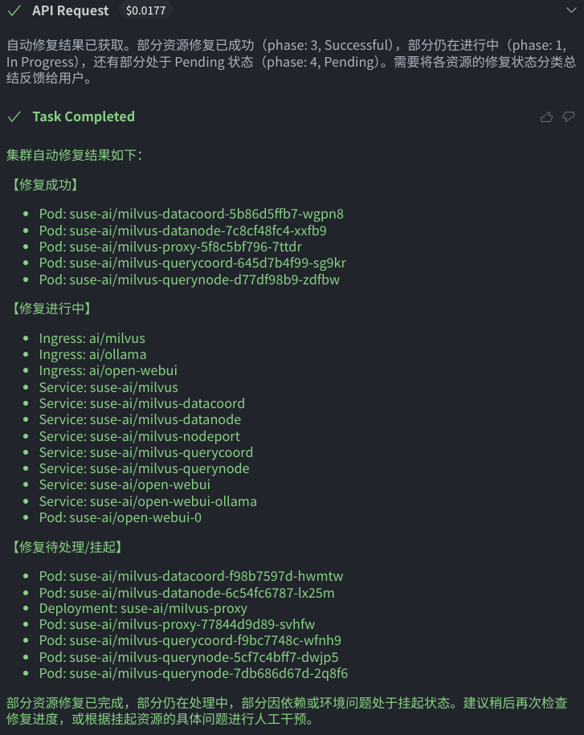

# Kubernetes Resource Check MCP Server

MCP Server for checking Kubernetes Resources.

> This project is currently in development status and not available to use in production.

## Usage

```sh
# Build the executable binary
go build .

./kube-helper-mcp -h
```

### Kubernetes Cluster Helper

Use the Kubernetes cluster helper MCP server to list/get the cluster resources.

```sh
# Run Kube Helper MCP Server in SSE Mode
./kube-helper-mcp run --config=${HOME}/.kube/config --sse

# Run Kube Helper MCP Server with mcpo to integrate with OpenWebUI
KUBE_CONFIG=${HOME}/.kube/config uvx mcpo --config ./mcpo/config.json
```

Demo:
<details>









</details>

### K8sGPT Helper

K8sGPT helper MCP server provides the abilities to use the [K8sGPT Operator](https://github.com/k8sgpt-ai/k8sgpt-operator/) to perform some cluster self-checks and automatic repair actions.

1. Install the [K8sGPT Operator](https://github.com/k8sgpt-ai/k8sgpt-operator/?tab=readme-ov-file#installation)

1. Create the OpenAI API secret key in the `k8sgpt-operator-system` namespace.

    ```sh
    kubectl -n k8sgpt-operator-system \
        create secret generic k8sgpt-openai-api-key \
        --from-literal=api-key=$OPENAI_TOKEN
    ```

1. Start the K8sGPT Helper MCP Server.

    ```sh
    # Run K8sGPT Helper MCP Server in SSE Mode
    ./kube-helper-mcp k8sgpt --config=${HOME}/.kube/config --sse

    # Run K8sGPT Helper MCP Server with mcpo to integrate with OpenWebUI
    KUBE_CONFIG=${HOME}/.kube/config uvx mcpo --config ./mcpo/k8sgpt-config.json
    ```

Demo:
<details>







</details>

## License

Licensed under the Apache License, Version 2.0 (the "License");
you may not use this file except in compliance with the License.
You may obtain a copy of the License at

http://www.apache.org/licenses/LICENSE-2.0

Unless required by applicable law or agreed to in writing, software
distributed under the License is distributed on an "AS IS" BASIS,
WITHOUT WARRANTIES OR CONDITIONS OF ANY KIND, either express or implied.
See the License for the specific language governing permissions and
limitations under the License.
